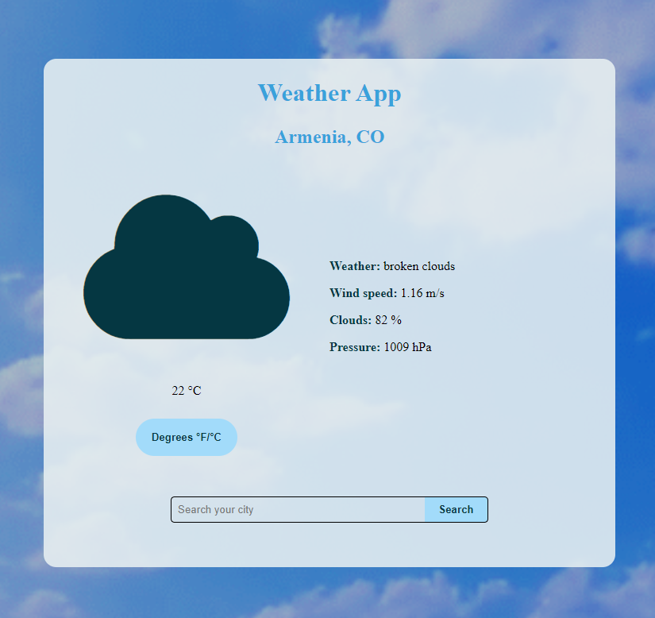
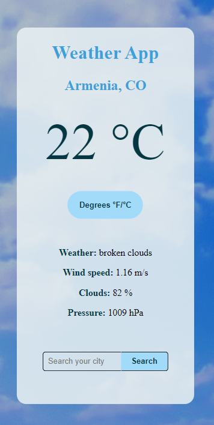
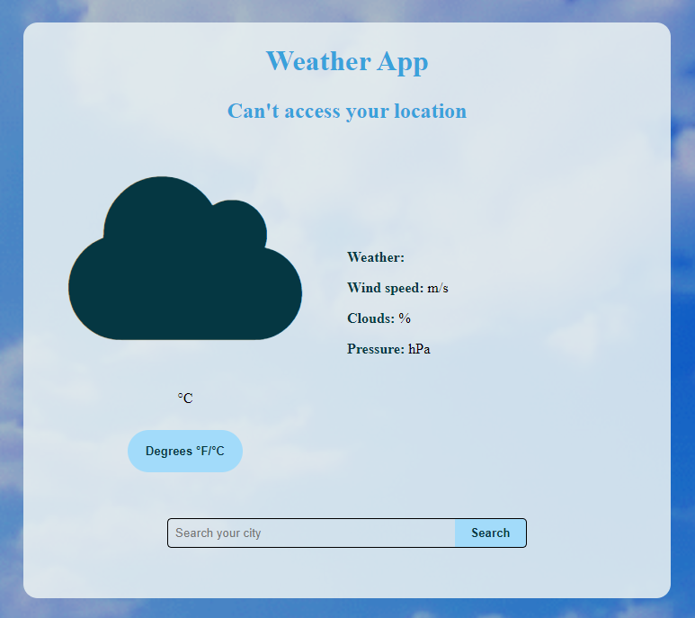
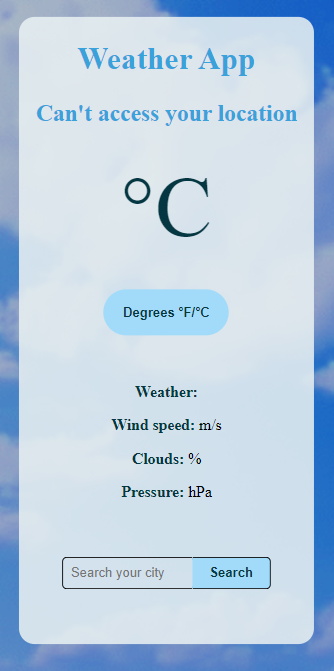

# Weather App

Aplicación del clima, aquí podrás ver la temperatura en grados celsius y fahrenheit donde te encuentres ubicado, sin embargo también puedes hacer una busqueda según la ubicación que deseas saber. Es importante reconocer que esta App consume los datos de la siguiente API: https://openweathermap.org/api

## Deploy

https://weather-app-ngg.netlify.app/

## Inicia el proyecto

Si desea ver el proyecto localmente, debes clonar e instalar las dependencias para ver correctamente la App.

## Instación

### `npm install`

En el directorio del proyecto, debe usar npm i y esperar la instalación de los siguientes programas:

<ul>
  <li>react</li>
  <li>axios</li>
</ul>

## Inicio

### `npm start`

En el directorio del proyecto, debe usar npm start y se abrirá http://localhost:3000 en una pestaña de tu navegador predeterminado; debes permitir conocer tu ubicación y así podrás conocer el clima de tu región. Aquí podrás visualizar la aplicación localmente y realizar cambios temporales si deseas.

  
  
  
  

Si tienes alguna sugerencia o comentario escribeme a mi correo o a mi perfil de linkin y con gusto lo tomare en cuenta!!

LinkedIn: https://www.linkedin.com/in/nicolasggdev/

E-mail: nicolasggdev@gmail.com

# Weather App

Weather App, here you can see the temperature in degrees Celsius and Fahrenheit where you are located, however you can also search according to the location you want to know. It is important to recognize that this App consumes data from the following API: https://openweathermap.org/api

## Deploy

https://weather-app-ngg.netlify.app/

## Start the project

If you want to view the project locally, you must clone and install the dependencies to properly view the App.

## Install

### `npm install`

In the project directory, you need to use npm and wait for the installation of the following programs:

<ul>
  <li>react</li>
  <li>axios</li>
</ul>

## Start

### `npm start`

In the project directory, you should use npm start and it will open http://localhost:3000 in a tab of your default browser; you must allow to know your location and thus you will be able to know the climate of your region. Here you can view the application locally and make temporary changes if you wish.

  
  
  
  

If you have any suggestions or feedback, write to my email or my linkedin profile and I will gladly take it into account!!

LinkedIn: https://www.linkedin.com/in/nicolasggdev/

E-mail: nicolasggdev@gmail.com
